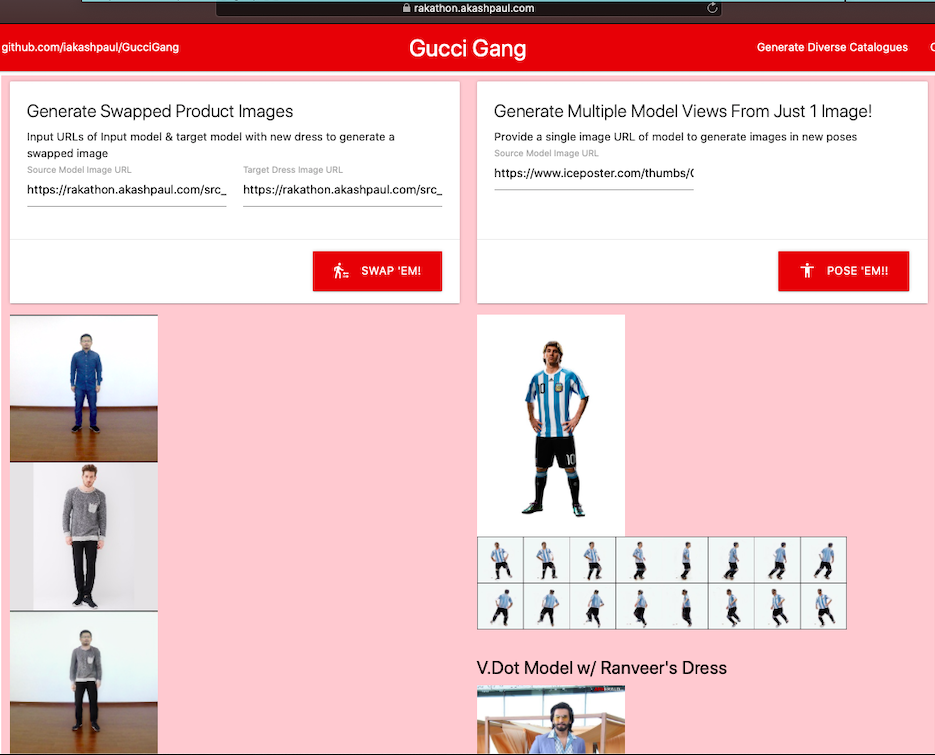
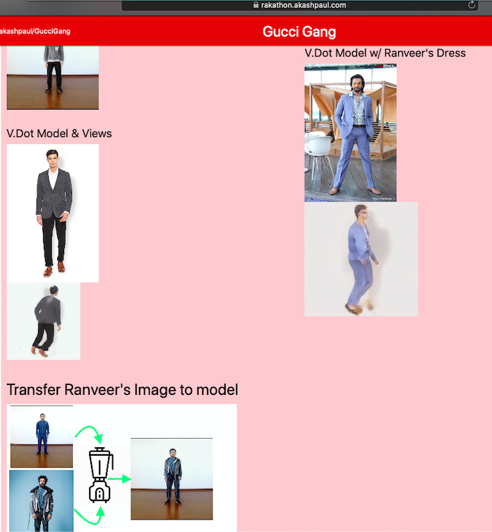

<!-- PROJECT LOGO -->
<br />
<p align="center">
  <a href="https://github.com/iakashpaul/GucciGang">
    Gucci Gang
  </a>

  <h3 align="center">TEAM: Blitzen Name: Akash Paul Regd No:2019009</h3>

  
</p>


<!-- ABOUT THE PROJECT -->
## About The Project

This is my entry to Rakathon 2019 finals, my tool makes use of Liquid Warping GANs paper for appearance & view synthesis [Liquid Warping GANs](https://svip-lab.github.io/project/impersonator.html)


[](https://www.youtube.com/watch?v=cykCJcYywwE)


### Built With

* TensorFlow
* PyTorch
* Node.js
* Deployed on AWS P2.xLarge instance & protoyping done on Google Colab


<!-- GETTING STARTED -->
## Getting Started

To get a deployed copy up and running follow these simple steps.

### Prerequisites

* Node.js dependencies are in the package.json

* Python requirements are mentioned in the respective folder's requirements.txt files (check the commands.txt file)

### Installation

* Clone the repo & follow the steps in the commands.txt, for more help refer to the included IPYNB for running in Google Colab for free GPU provisioning

* Configure the SSL certificate for your server using nginx & your DNS configuration

* Run the node.js app using, ```pm2 start index.js```

* Also run visdom in the background on the server using, ```visdom &```

<!-- USAGE EXAMPLES -->
## Usage

* You can visit the page & try out both the tools as shown below,





<!-- ROADMAP -->
## Roadmap

The quality of the images can be improved by trainnig on higher quality datasets & increasing units in different layers, also to strive for acceptable performance on CPU instead of the GPU with quantization.


<!-- LICENSE -->
## License

Sub-projects are distributed under their respective licenses. See individual `LICENSES` for more information.
Code written by me is MIT licensed


<!-- CONTACT -->
## Contact

Akash Paul - [@iAkashPaul](https://twitter.com/iAkashPaul)

Project Link: [https://github.com/iakashpaul/GucciGang](https://github.com/iakashpaul/GucciGang)


<!-- ACKNOWLEDGEMENTS -->
## Acknowledgements

* [Liquid Warping GANs](https://svip-lab.github.io/project/impersonator.html)


